# 程序设计A-LAB0

> LAB0目标：
>
> 1. 了解本门课程内容以及课程常用工具
> 2. 环境搭建以及运行第一个C程序
> 3. 了解作业提交方式以及常用的编程工具


## 获取及提交lab

**获取**：通过 `https://github.com/fdu-20ss-programming-A/lab0`获取（建议通过Download ZIP方式下载）。

**提交物**：将配置环境的过程、运行环境的测试结果、第一个C程序的运行结果截图并整理（格式为word或者pdf，页数不超过5页）。文档中也可以记录LAB遇到的问题或者对课程的想法。

**提交**：将提交物文档命名为学号_姓名 （如20302010000_王明），提交至超星学习通对应的作业中。

**截止时间**：暂定北京时间 2020年9月19日 23:59:59


## 环境准备

### 为什么需要编码环境

课程学习的编程语言为C语言。C语言是一种高级语言，由高级语言编写的程序为源代码。计算机不能直接运行源代码，必须将源代码翻译为机器可执行的机器代码后计算机才能运行程序。从上述过程可知，完成编程过程需要两个重要工具：代码开发环境以及编译器。

代码开发环境是开发者的工作平台，开发者直接在代码编辑器中编写代码完成特定的程序。除了编辑功能，代码开发环境一般也包括了代码补全、代码静态检查等功能。

编译器将高级语言编写的源程序翻译为机器可执行的格式。主流的C语言编译器包括GCC以及Clang。GCC是最通用的编译器，对标准支持比较好，所以一般推荐GCC编译器。

除了以上两者，调试器也是编码中常用到的工具。调试器让程序在希望的地方停下，此时支持查看变量、寄存器、内存及堆栈。更进一步能够修改变量及内存值。GDB是主流的C、C++调试器，功能强大，特别方便开发者调试程序寻找bug。

不同的操作系统对软件的支持程度不一样，所以配置各种操作系统的过程有所差异。主流的操作系统为Windows，MAC OS，Linux。个人电脑主要为Windows以及MAC OS，所以我们将分别介绍Windows和MAC OS配置环境的过程。

### Windows环境配置过程（MAC用户可忽略）

#### Step 1：MinGW包管理工具

MinGW(Minimalist GNU For Windows)是个精简的Windows平台C/C++编译器。MinGW提供了一个完整的开源编程工具集，方便开发者进行C/C++运行库的管理。通过MinGW我们能够很快安装GCC以及GDB等编码环境。

##### 下载MinGW

[点击这里开始下载MinGW](https://osdn.net/projects/mingw/downloads/68260/mingw-get-setup.exe)

点击链接后，浏览器将会自动下载MinGW，等待下载完成即可。

##### 安装MinGW

> 注意：安装时请保证网络能够正常使用。

打开下载好的`mingw-get-setup.exe`安装程序，按照默认选项进行安装。

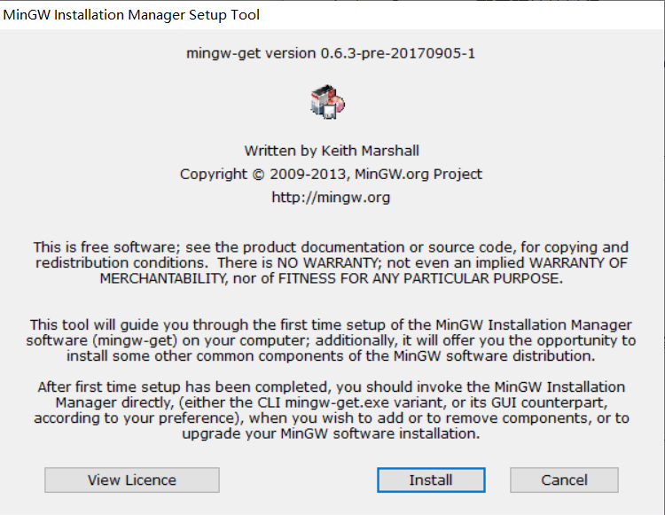

安装路径默认在C盘，我们也可以自定义安装位置。

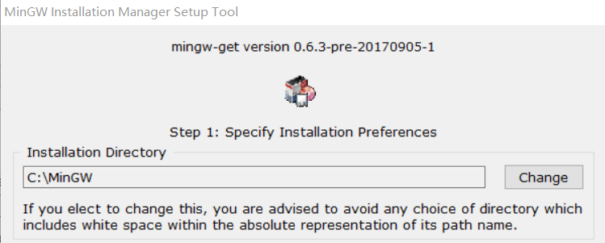

> 注意：安装的位置将会在后面使用到，所以请务必记住安装的路径。

MinGW安装结束后，我们将会看到MinGW的包管理页面。


#### Step 2：GCC编译器以及GDB调试器

##### 准备GCC编译器

在MinGW包管理页面中，找到`mingw32-gcc-g++-bin`,点击选择`Mark for Installation`。

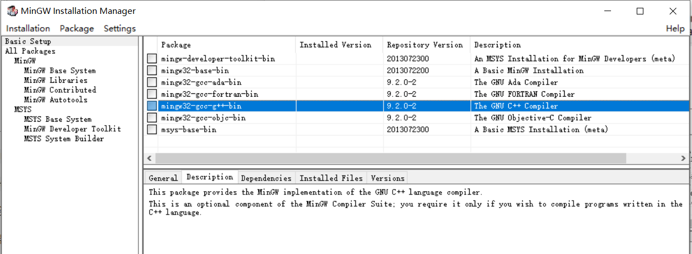

##### 准备GDB调试器

点击MinGW包管理工具左侧`All Packages`，再点击`MinGW Base System`。在右侧列表中寻找`mingw32-gdb-bin`，点击选择`Mark for Installation`。

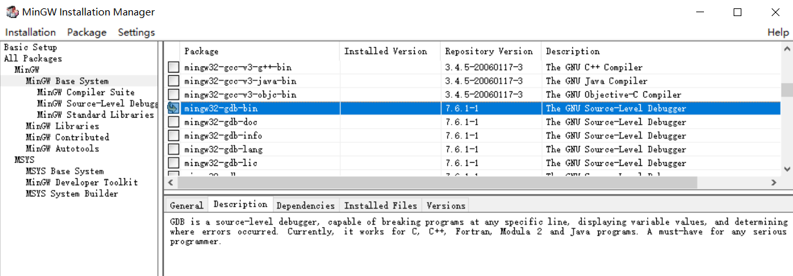

##### 开始下载相关软件

点击左上角的 `Installation` 菜单中的 `Apply changes` 选项，然后管理器将开始在线安装或更新被选中的组件。

安装完成后关闭包管理器，如果由于某种原因安装未能成功，在退出程序前程序将给予提示，选择 `review changes` 选项重新安装即可。

#### Step3：配置环境变量

> 环境变量是指操作系统运行环境的参数，一般是文件夹路径。当我们输入gcc命令时，我们希望操作系统在我们指定的位置上寻找gcc文件。

打开 控制面板 -> 系统和安全 -> 系统 -> 高级系统设置 -> 环境变量。

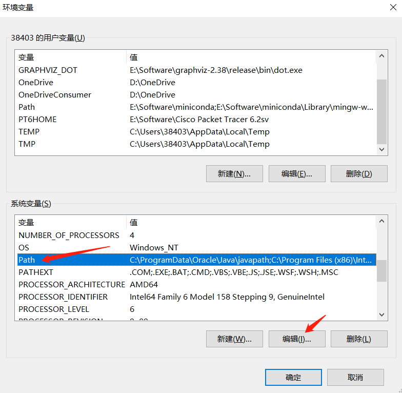

在`系统变量`中寻找`Path`，点击编辑。

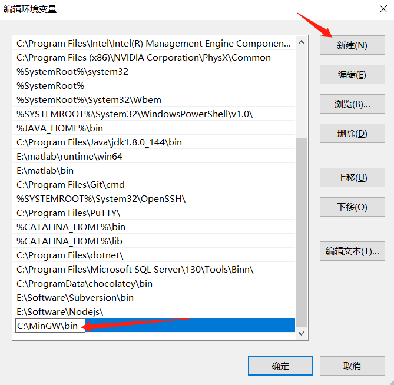

点击`新建`，在尾部插入MinGW安装的路径，点击确认。

> 注意，这里使用默认路径，如果你修改了MinGW的安装路径，请使用**你自己配置的MinGW安装路径下的bin文件位置**。

#### Step4：测试环境

之前的工作完成后，我们测试一下已经配置好的环境。

##### 打开命令行终端

键盘输入`win+r`，打开的页面中输入cmd，点击确定。

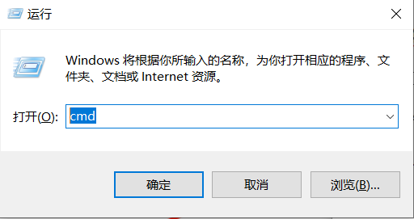

完成后，将打开命令行终端。

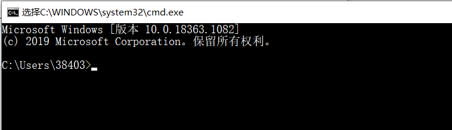

##### 测试GCC与GDB

在终端中输入`gcc -v`查看GCC的版本信息，输入`gdb -v`查看gdb版本。

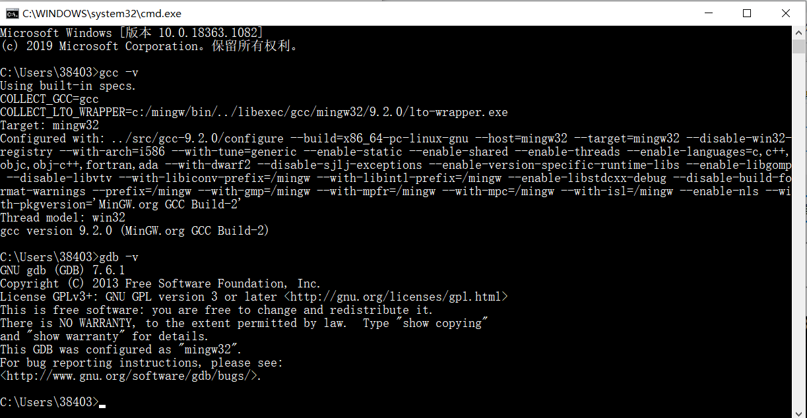

如果出现以上结果，则说明安装成功。如果出现gcc命令不存在的提示说明过程有误，建议检查环境变量的路径是否正确。

#### Step5：集成开发环境Code::Blocks

> Code::Blocks是轻量级的C/C++的集成开发环境。本课程主要以Code::Blocks为例讲解代码，希望大家都能准备Code::Blocks开发环境。

##### 下载Code::Blocks

[点击这里下载Code::Blocks](http://sourceforge.net/projects/codeblocks/files/Binaries/20.03/Windows/codeblocks-20.03-setup.exe)

点击链接，下载Code::Blocks安装包。Code::Blocks安装包相对比较大，下载时请耐心等待。

##### 安装Code::Blocks

打开安装包`codeblocks-20.03-setup.exe`，按照提示，使用默认配置即可。

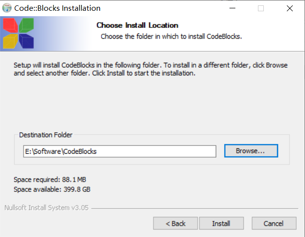

Code::Blocks安装位置可以根据自身情况自由选择。

##### Code::Blocks配置

> Code::Blocks是代码开发平台，我们需要为其指定gcc编译器以及gdb调试器。

安装完成后，打开Code::Blocks。

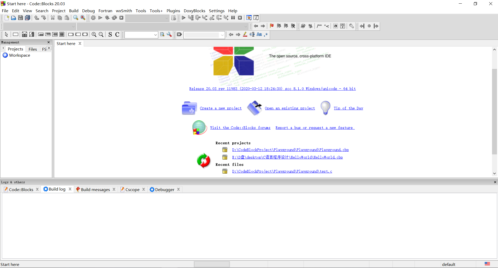

打开 `Settings`->`Compiler`->`Global compiler settings`->`Toolchain executables`。修改`Compiler's installation directory` 为MinGW/bin的路径。

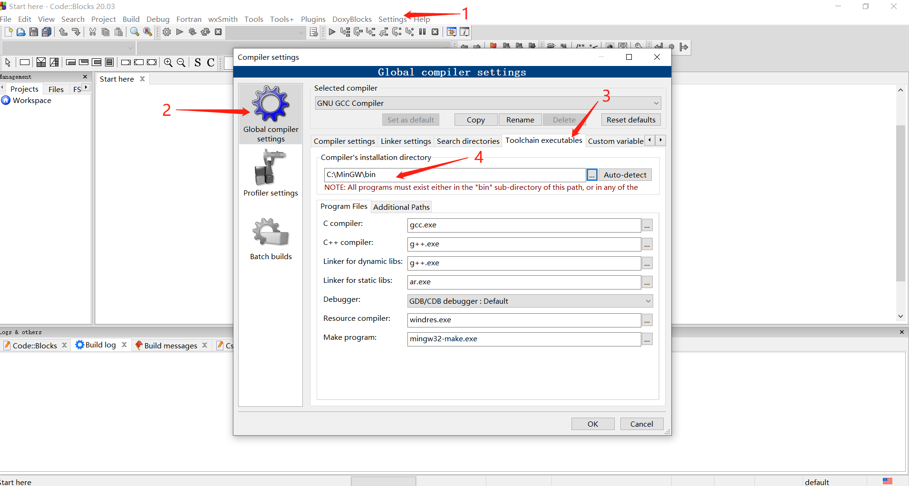

打开`Settings` -> `Default`，修改`executable path`为MinGW/bin/gdb.exe的路径。

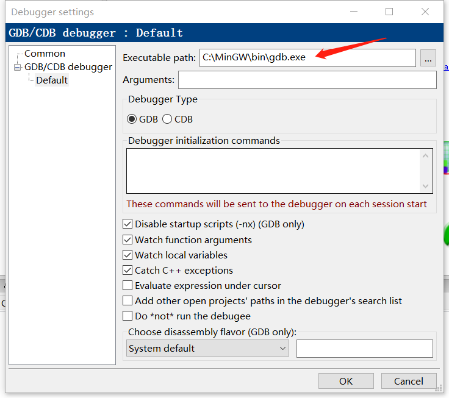

至此，Code::Blocks开发环境准备完毕，同学们可以根据课程内容尝试在Code::Blocks上运行程序。

### MAC OS配置环境过程（Windows用户可忽略）

#### Step 1: 打开终端

`command + 空格` 打开聚焦搜索，在搜索框中输入 `terminal`，点击下方 “终端” 或直接回车，即可打开终端

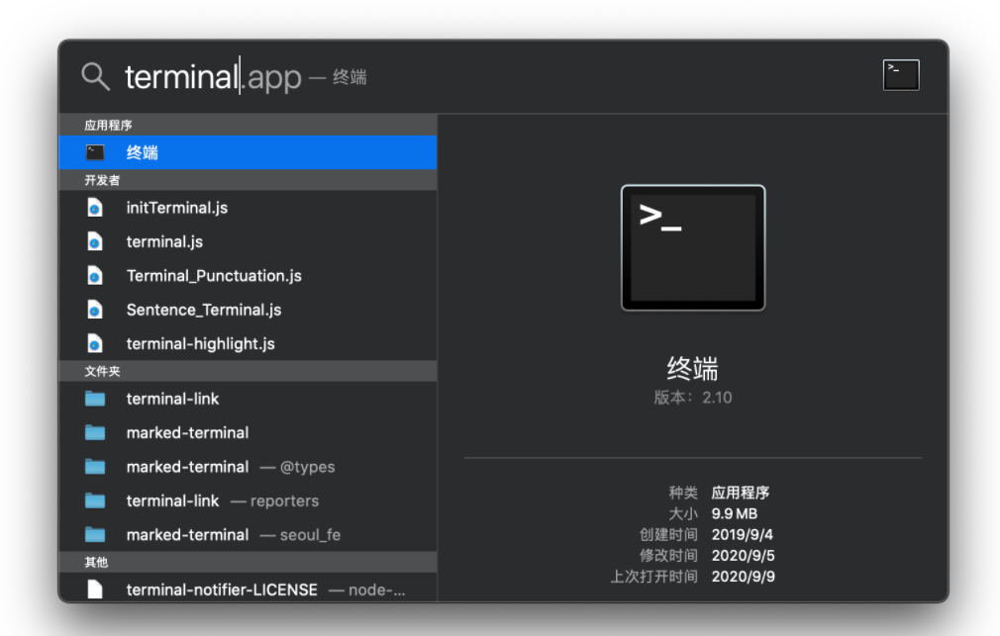

#### Step 2: 检测GCC编译器

在终端中输入：

```
$ gcc -v
```

若终端返回以下内容，则说明你已经安装好 `gcc` 了，若没有返回类似内容，你需要在 `App Store` 内下载 `Xcode` 软件，再重新打开终端尝试。

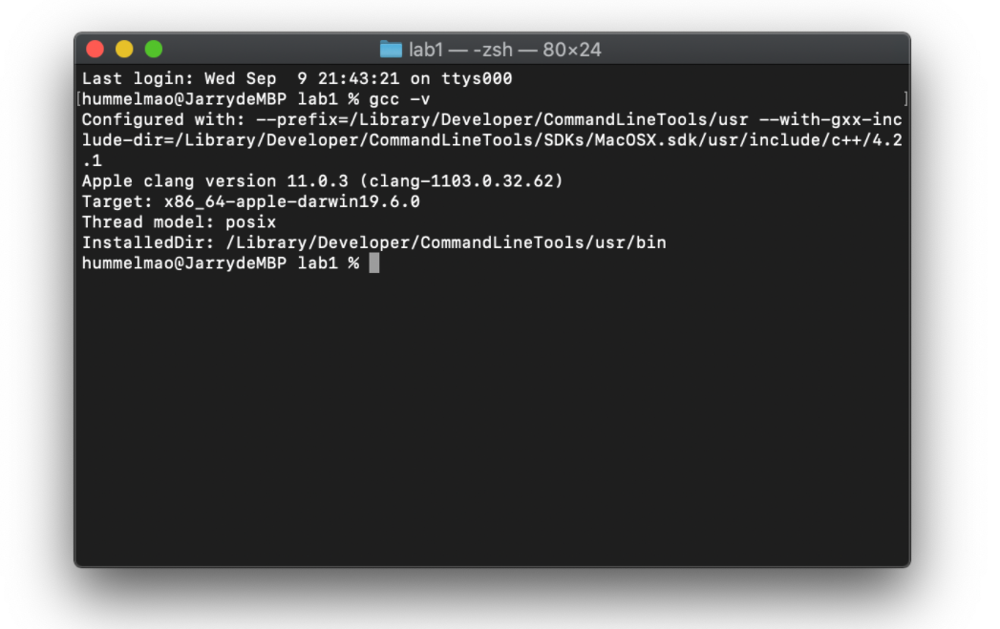

#### Step 3: 安装Code::Blocks或者Clion

MAC OS安装Code::Blocks相对比较繁琐，具体参考[链接](https://www.dummies.com/programming/cpp/how-to-install-c-codeblocks-in-macintosh/)。

编程工具是次要的，在MAC OS上我们更加推荐Clion，具体安装过程请点击[这里](https://www.cnblogs.com/little-cat/p/clion-anzhuangpeizhi.html)。

> Clion是商业软件，学生可以[进行学生身份认证](https://www.jianshu.com/p/2c6977ab00b1)获取一年的免费使用权限。


## 运行第一个C程序

Hello World是著名的贝尔实验室提出的范式了，学任意编程语言，Hello World都是起始代码。在集成编译环境中，很多必要的工作被IDE（集成开发环境）隐藏，所以第一次LAB我们希望大家先学习最经典的程序运行方式。这里我们将学习如何在命令行中编译运行helloworld.c。

### Step 1: 编写代码

在桌面新建文件helloworld.c，将以下代码复制至文件中，保存文件。

```
#include <stdio.h>

int main(){
	printf("Hello World/n");
	return 0;
}
```

> 这里只需要用简单的文本编辑器编辑文件即可。Windows可以使用记事本，MAC OS可以使用文本编辑器。
>
> helloworld.c文件的位置可以自由选择。

### Step 2: 进入文件所在位置

使用配置环境中提到的方法打开命令行终端，输入以下命令：

```
# Windows用户
cd desktop
# MAC OS用户
cd ~/desktop
```

因为我们创建的文件在桌面上，所以我们能够在当前位置找到`helloworld.c`。

>cd是命令行中常用命令，用于切换工作目录。这里我们使用cd命令寻找helloworld.c的父目录。

### Step 3: 编译运行helloworld.c

在`helloworld.c`所在文件夹中输入以下命令编译程序：

```
$ gcc helloworld.c -o helloworld.exe
```

编译成功后将在桌面产生`helloworld.exe`可执行文件，然后输入以下命令运行我们编译输出的文件:

```
# windows用户
$ ./helloworld.exe
# MAC OS用户
$ ./helloworld.exe
```

看看能否输出`Hello World`？

如果成功输出`Hello World`，那么恭喜，编程生涯正式开启！